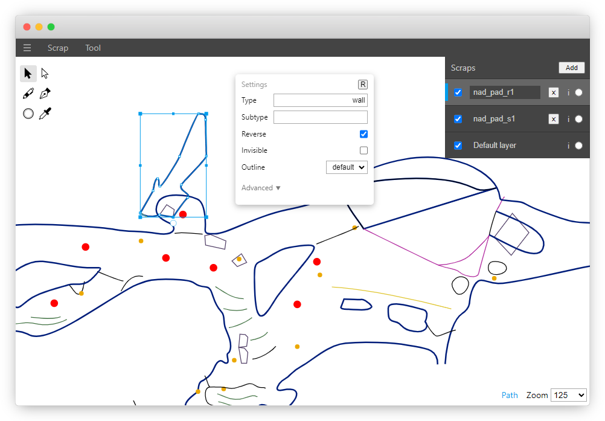

# A web-based Therion map editor

	

Based on [papergrapher](https://github.com/w00dn/papergrapher/), powered by Paper.js

## Demo
An automatically built version is available at https://daem-on.github.io/wtherion .

Feature showcase video: https://www.youtube.com/watch?v=kpogxtt_4TI

For end-user documentation, go to the [wiki on GitHub](https://github.com/daem-on/wtherion/wiki).

## Design
Documentation of the code and design decisions will be added once most functionality is finished.

Since this app is based on a vector graphics editor, there is still some functionality that doesn't need to exist in this cave drawing app but remains from the original version.

## Development and building
Use `yarn` and `yarn serve` to run for development. Use `yarn build` or look at the GitHub action for building.